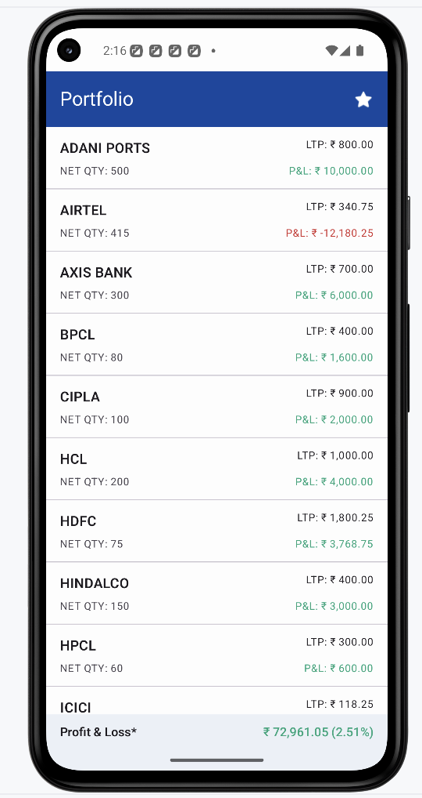
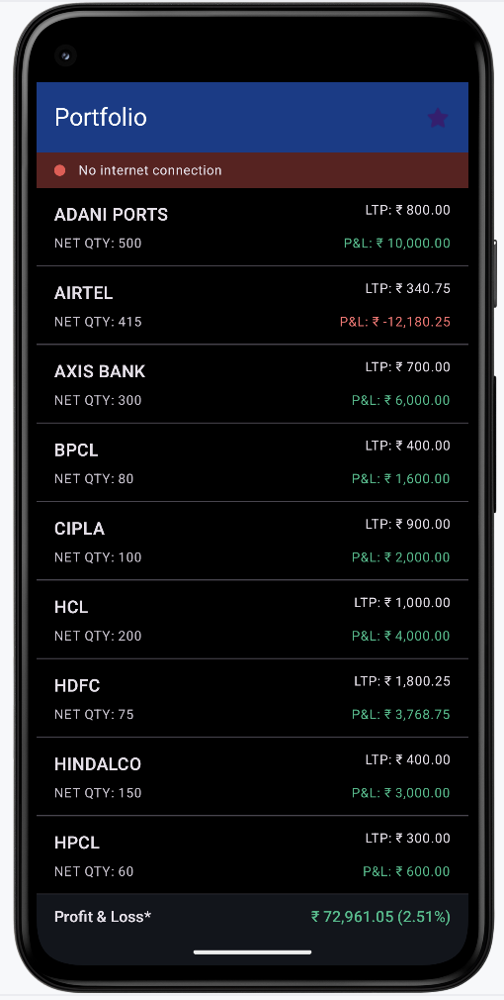

# LavishDemo

A modern Android portfolio holdings app that shows a list of stocks, a sticky P&L summary, pull‑to‑refresh, light/dark themes, and an online/offline banner. Built for speed, readability, and maintainability.

## Screenshots

| Light | Dark |
|---|---|
|  |  |


## Highlights
- Jetpack Compose UI with Material 3
- MVVM + Clean Architecture
- Hilt for DI
- Room for offline cache
- Retrofit + OkHttp + Kotlinx Serialization
- Pull‑to‑Refresh, sticky P&L bar, Internet Connectivity Banner
- Unit tests with MockK, Coroutines Test

## Architecture (Clean + MVVM)
- presentation: Compose screens + ViewModel (state, UI logic)
- domain: use cases, domain models, repository interface
- data: repository impl, Room (DAO/entities), Retrofit (service/DTOs), mappers

Flow:
ViewModel → UseCase → Repository (cache + network) → Room/Retrofit → ViewModel → UI

## ERD (simplified)
```
+------------------+
| holdings         |
+------------------+
| id (PK)          |
| user_id          |
| symbol           |
| quantity         |
| ltp              |
| avg_price        |
| close            |
| updated_at       |
+------------------+
```

## Networking
- Base URL: `https://35dee773a9ec441e9f38d5fc249406ce.api.mockbin.io/`
- JSON via Kotlinx Serialization
- Retrofit service returns DTOs; mappers convert to domain models

### Long Polling
- A lightweight refresh loop in `ViewModel` that waits a fixed interval (e.g., 30s) and re-fetches holdings.
- Keeps UI updated without WebSockets complexity.
- Interval is centralized in `PollingConfig`.

## Offline-first
- On app open: try network → update cache; on failure → serve cached
- Room stores the last known portfolio for quick launch and offline viewing
- Logs added for “serving from DB” vs “fetched from network”

## Online/Offline banner
- Small sticky banner below the top bar
- Red/“No internet connection” when offline
- Green/“Back online” when connectivity returns; auto-hides after ~2.5s
- Uses `ConnectivityManager` and a Flow in a `NetworkMonitor`

## UI notes
- Sticky P&L summary at screen bottom; expandable/collapsible in place
- Pull‑to‑Refresh via Compose pull refresh API
- Light/Dark theme toggle in the top bar

## Calculations
- Current Value = Σ(LTP × Qty)
- Total Investment = Σ(AvgPrice × Qty)
- Total P&L = Current Value − Total Investment
- Today’s P&L = Σ((Close − LTP) × Qty)

## Project structure (key files)
```
app/
  src/main/java/com/assignment/myportfolio/
    presentation/  -> Compose screens + ViewModel
    domain/        -> usecases, models, repository interface
    data/          -> retrofit, room, mappers, repo impl
    di/            -> Hilt modules (network, bindings)
    core/          -> NetworkMonitor, PollingConfig
  res/             -> themes, strings, layouts (Compose-first)
```

## Build & run
- Android Studio (Giraffe+), JDK 17
- Gradle 8.9, AGP 8.7.2, Kotlin 2.0.2
```


